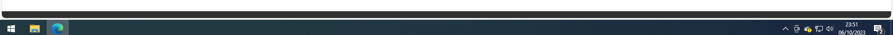
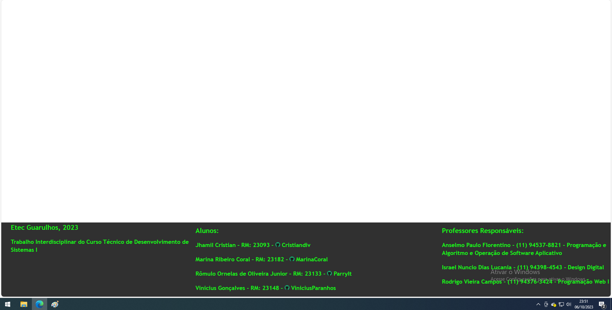

# rodapeCSS
um rodapé que eu fiz para um trabalho de web design na ETEC. Feito para este site https://capitaocrunch.000webhostapp.com/
  

  <h3>Barra sem o cursor encostar</h3>
  

  

  <h3>Barra depois que o cursor encosta (informações totalmente falsas só para ilustrar e desculpem o windows pirata xD)</h3>
  

